<script type="text/javascript">
function showHide(targetID) {
	if( document.getElementById(targetID)) {
		if( document.getElementById(targetID).style.display == "none") {
			document.getElementById(targetID).style.display = "block";
		} else {
			document.getElementById(targetID).style.display = "none";
		}
	}
}
</script>
<a id="top"></a>

# UML(Unified Modeling Language:統一モデリング言語)

UMTP勉強用

ソフトウェアの成果物を仕様化・図式化する方法を規定したもの。
OMG(Object Management Group)によって標準化された表記法のみ。UMLで規定するのは表記法のみで、開発プロセス(Unified Process, XP, Agile, etc.)は統一されていない。

抽象化された概念をもとに、分析領域の全体像を視覚的にわかりやすく表現することを**モデリング(Modeling)**と呼ぶ。

### MDA(Model Driven Architecture)

実行可能なシステムをモデルから自動生成する技術

### Action Language

ステートマシン図でアクションの定義を記述するための言語

## UMLの構成要素

- **Infrastructure:　**アーキテクチャの再構築や拡張メカニズム
- **Superstructure:　**UMLの図や要素
- **Diagram Interchange:　**図とその情報を相互に交換する形式をサポート
- **[OCL(Object Constraint Language)](#OCLSec):　**Superstructureで規定仕切れない情報(制約)をテキストで表現

## UMLで規定されるダイアグラム
<a id="agenda"></a>

- 構造図
	- [パッケージ図(Package Diagram)](#packageDiaSec)
	- [クラス図(Class Diagram)](#classDiaSec)
	- [オブジェクト図(Object Diagram)](#objDiaSec)
	- [合成構造図(Composite Structure Diagram)](#compositeStructureDiaSec)
	- [コンポーネント図(Component Diagram)](#componentDiaSec)
	- [配置図(Deployment Diagram)](#deploymentDiaSec)
- 振る舞い図
	- [ユースケース図(Use Case Diagram)](#usecaseDiaSec)
	- [アクティビティ図(活動図)(Activity Diagram)](#activityDiaSec)
	- 相互作用図(Interaction Diagram)
		- [シーケンス図(Sequence Diagram)](#seqDiaSec)
		- [コミュニケーション図(Communication Diagram)](#comDiaSec)　*旧コラボレーション図(協調図)*
		- [相互作用概要図(Interaction Overview Diagram)](#interactionOverviewDiaSec)
		- [タイミング図(Timing Diagram)](#timingDiaSec)
	- [ステートマシン図(状態機械図)(State Machine Diagram)](#stateMachineDiaSec)　*旧ステートチャート図*


## ノート(note)

付箋のようなアイコンで要素をまとめることができる。**全てのUML要素**につけることができる。点線でアンカーする。


## UMLの各図の対応関係

クラス図 | 相互作用図
------- | --------
クラス | ライフライン
操作 | メッセージ
関係 | メッセージ

シーケンス図 | コミュニケーション図
---------- | ------------------
各要素 | 各要素

ステートマシン図 | 相互作用図
-------------- | ---------
トリガー | メッセージ

## 開発プロセス

開発プロセス | 意味
:--- |:---
Unified Process | IBM提唱。「分析」、「設計」、「プロジェクト管理」、「テストケース作成」を含むユースケース駆動開発で、アーキテクチャ中心。反復も管理される。
XP | Kent Beckらが提唱。軽量なプロセス。
Agile | XP, Scrum, FDD, Crystalを含む複数のプロセスの集合体。
反復型プロセス | UMLを使用した開発で採用される。「分析」「設計」「実装」「テスト」の工程を繰り返し(２週間から４ヶ月に１回程度)ながら開発する。リスクが高い、優先度が高いものは、初期の繰り返しで実施する。リスクがそれほど高くないシステムでは他のプロセスを採用しても問題ない。

### Unified Process

IBMが提唱するプロセス。**JISでは規定されていない**。
ユースケースを基に、分析、設計、**プロジェクト管理、テストケース作成**などを含む**ユースケース駆動**開発。**ドキュメント駆動ではなく**、**実際に動く**システムを作り確かめながら反復開発を行う。**反復も管理する**。反復開発の**前半でアーキテクチャを確立し**、後半はそれに沿ってシステムを量産する。

- **ユースケース駆動**
- **アーキテクチャ中心**
- リスクが高い機能をより早期に開発する
- **管理された反復**

1. 方向付けフェーズ：　プロジェクトを開始することの実現可能性、妥当性を判断する
1. 推敲フェーズ：　対象としているシステムのアーキテクチャのベースラインを決定する
1. 作成フェーズ：　製品レベルのシステムを作る
1. 移行フェーズ：　利用環境に適応しているかの確認を行う

### 反復型開発プロセス

**事前に何回の反復をいつまでに行うかを計画する。反復と反復の合間**で、顧客の要望を受け入れられる。それぞれの反復でシステムの**異なる部分**の開発を行い、実際にその部分は稼働させて、評価を行う。反復の計画には、開発者の要員数の計画も含まれており、開発を開始してからは開発要員数がたびたび変化することはない。１回の反復で、**全ての工程を行う必要はなく、反復回数、期間は決まっていない**。

- システムのリスクを早期に発見し回避できる
- 仕様変更に対する柔軟な対応ができる
- 繰り返し検証を行うことにより品質が向上する
- 分割で１つの作業単位が小さくなるので複雑さが低減する

反復型開発プロセスの工程 | 使用するダイアグラム | 概要
:--- |:--- | ---
要求分析(requirements analysis) | ユースケース図、アクティビティ図 | 
分析(analysis) | クラス図、シーケンス図、コミュニケーション図、ステートマシン図、オブジェクト図、相互作用概要図 | 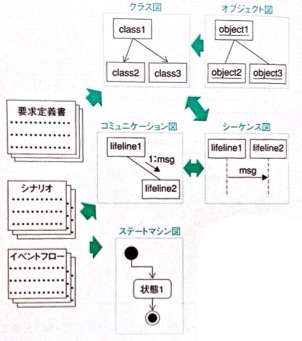
設計(design) | クラス図、シーケンス図、コミュニケーション図、ステートマシン図、アクティビティ図、オブジェクト図、コンポーネント図、配置図、相互作用概要図、合成構造図、タイミング図、パッケージ図 | 
実装 |
テスト |

# モデリング(Modeling)

抽象化された概念を基に、モデリング対象の全体をビジュアルにわかりやすく表現すること。枝葉末節にこだわらず、本質的な部分を中心にして考えることが重要。

## ビジネスモデリング

システム開発の分析、設計を行う前前に、対象としている業務に必要なもの、こと、人、組織とその相互関係及び業務フローを明確にする。この段階では、モデリングの対象は、必ずしもシステム化する部分のみではない。

- （ビジネス）ユースケース図：　業務明確化、洗い出し。
	- ビジネスユースケース：　業務
	- ビジネスアクター：　業務の利害関係者
	- 境界：　分析対象の企業、組織を囲む
- クラス図：　その業務に必要なもの、こと、人、**組織**とその相互関係。
- 相互作用図：　**クラスを基に**ビジネスユースケースの詳細な流れを表現する。
- アクティビティ図：　業務フロー。**クラスを意識しないで**ビジネスユースケースの詳細な流れを表現する。
	- アクティビティパーティション：　業務を行っている人、組織を表現する。


## 要求モデリング

ユーザーのシステムに対する要求を聞いて、それを定義する。この段階では、システムの内部はブラックボックス化して、システムの外から見た機能のみに着目する。

## 分析モデリング

システム化対象の業務部分に着目したモデルを作成する。この段階では、開発言語やDBなど、**開発環境、実行環境に依存しないモデル**を作成する。

## 設計モデリング

システムの実現手段を考慮したモデルを作成する。

---

## 要求分析/定義モデリング

### ユースケース図のモデリング

対象システムで実現予定の機能がすべてユースケースで表現されてい
る必要がある。

1. アクターの発見（個人名ではなく役割）
1. ユースケースの発見（アクターが目的を達成できるサイズである）
1. アクターとユースケースを関連で接続

### ユースケース記述(use case description)

- *XYZ公式*:　"do X by Y in order to Z"の形式。

#### ユースケース名

アクターの行為を支援する手段名「(システムは)YをXする」という形式。

#### 概要

１つのユースケースに対して、数行程度の説明。

#### アクター

ユースケースの行為者(顧客または施主の代理人のロール)

#### 目的

ユースケースの存在意義。(顧客 or 施主は)「Zしたい」あるいは「Zするため」という形式。

#### シナリオ

ユースケースのインスタンス（具体例）。
１つのユースケースの１つの流れを、具体例で記述した文章。シナリオ内で記述する名称、金額、数量などは実際の値を仕様し、現実に処理が行われたように記述する。

#### イベントフロー

フロー | 説明
:--- |:--- 
事前条件 | このユースケースを開始するための制約や条件。**ユースケース開始前のものの状態**。
事後条件 | このユースケースが終了した後の制約や条件。**ユースケース終了後のものの状態**。
基本フロー | このイベントフローの最も一般的な流れ。アクターとシステムの対話内容を、順序番号をつけて記述する。主語を"アクター"または"システム"と明示する。
代替フロー | 基本フローより頻度が少ない正常な流れ
例外フロー | 正常終了しない流れ

#### 備考

解説や非機能要求などがあれば書く。

#### 変更履歴

変更日時、カ所、内容、理由、担当者、承認者 etc.

## 構造モデリング

分析モデリング、設計モデリングの両方で行われる。
静的構造のモデリングと動的振る舞いのモデリングは互いに密接に関係しているので、同時並行して行われる。

1. 名詞を出してクラスを発見する
1. クラス候補を選別する
1. モデルを考えてクラス間に関係をつける(汎化すると切り替えにインスタンスの生成を要する)
1. 多重度を考える
1. 制約をつける
1. 汎化を考える(どれか一つを選ぶようなやつは汎化できないか考える)

## 振る舞いモデリング

分析モデリング、設計モデリングの両方で行われる。

クラス図と相互作用図は平行して作成する。相互作用図はシナリオに対応する。流れはシナリオを、ライフライン候補は初期のクラス図を参考にして、相互作用図を作成する。

ステートマシン図を考えるときは、まずどのうような状態があるかを抽出する。次に、状態をトリガーで接続する。その後コンポジット状態などを用いて、複雑な状態を整理する。

業務フロー、ユースケースのイベントフロー、フローチャートの代替にアクティビティ図を使う。

## 実装モデリング

## 複数の図を利用したモデリング

1. 事例からクラス候補をを抽出する
1. クラス候補と処理の流れからシーケンス図(コミュニケーション図)を作成する
1. シーケンス図からもとのクラス図に情報を追加する。多重度などをオブジェクト図から考える。オブジェクトの状態はステートマシン図を利用する。

--
<a id="packageDiaSec"></a>
# [パッケージ図(Package Diagram)](#agenda)

UMLのモデル要素をまとめて整理する。

## パッケージ図の要素
<a id="packageDia/element"></a>

要素 | 表示形式 | 意味
:--- |:---: |:---
パッケージ(package) | 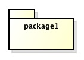 | **全てのUML要素**をまとめる。入れ子にできる。
[包含、階層化(nest)](#packageDia/nest) | 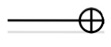 | パッケージのネスト。
[依存(dependency)](#packageDia/dependency) | 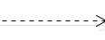 | パッケージ内の要素が他のパッケージ内の要素を利用している。利用される側に矢印をつける。`<<import>>`をつけても良い。
汎化(generalization) |  | より汎用的なパッケージと具体的なパッケージの関係。汎用的なパッケージの側に矢印をつける。

## パッケージ間の関係
<a id="packageDia/nest"></a>
### [パッケージの階層化](#packageDia/element)

入れ子にしても良いし、包含する側に＋アイコンをつけて結んでも良い。


<a id="packageDia/dependency"></a>
### [パッケージの依存関係](#packageDia/element)

クラス図で関連がある場合、パッケージ図では依存関係にある。


--
[パッケージ図](#packageDiaSec)　[目次へ戻る](#agenda)

--
<a id="usecaseDiaSec"></a>
# [ユースケース図(Use Case Diagram)](#agenda)

システムに対して要求する機能(ユーザ視点)、システムが提供すべき機能(システム開発者視点)を表現する。ユースケース図は、システム開発の初期段階に要求定義を明確にする目的で使用する。アクターはシステムの外部、ユースケースはシステムの内部に存在する。必要であれば何枚でも作成する。拡張予定の機能は表現できない。

<a id="usecaseDia/element"></a>
## ユースケース図の要素

要素 | 表示形式 | 意味
:--- |:---: |:---
[アクター(actor)](#usecaseDia/actor) | 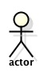 | 対象とするシステムを起動したり、データのやり取りをしたりする人や外部ハードウェア、他システム等。
[ユースケース(use case)](#usecaseDia/usecase) |  | ユーザから見た１つの完結した機能。ユースケースのサイズはアクターから見て、１つのユースケースを終了すればその目的が達成されており、かつ１つのユースケースの中では中断が行われないことを目安とする。
[関連(association)](#usecaseDia/association) | 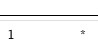 | アクターとユースケースのコミュニケート関係を示す。
[汎化(generalization)](#usecaseDia/generalization) |  | ユースケース、アクターを汎化させる。
[包含(inclusion), 拡張(extension)](#usecaseDia/dependency) |  | 依存関係の記号でユースケースの包含関係と拡張関係を表現できる。
[システム境界](#usecaseDia/border) | - | 対象とするシステムの内部と外部の境界

<a id="usecaseDia/actor"></a>
## [アクター(actor)](#usecaseDia/element)

スティックマン以外のアイコンも使用可能。

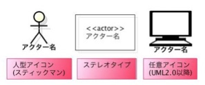

1. 人名ではなく**役割**
1. システムと直接関わっている
1. 人以外にシステムと**直接関わる既存システム（＊アクターとしか関わっていない既存システムはアクターではない）、ハードウェア**(*プリンターはアクターとせずとも良い*)

<a id="usecaseDia/usecase"></a>
## [ユースケース(use case)](#usecaseDia/element)

ユースケース名は、アクターが「〜する」という動詞形または名詞形とし、一つのユースケース図内で統一する。**１つの画面**で表示されるようなものは**１つのユースケース**になりやすい。

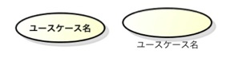

## 関係(relationship)
<a id="usecaseDia/association"></a>
### [アクターとユースケースの関係](#usecaseDia/element)

アクターとユースケースを**関連**で結んでコミュニケート関係を示す。関連には多重度を設定できて、アクターがユースケースを複数回利用することを表現できる。
 
 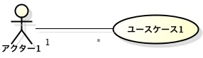
  
### [アクター同士の関係](#usecaseDia/element)

あるアクターと関連がある全てのユースケースすべてに、他のアクターも関連を持つ場合、**汎化(generalization)**の関係をつけて関連の記述を減らす。

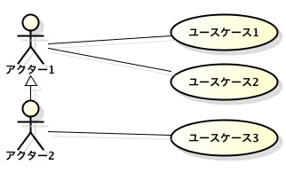*Bはユースケース1,2,3と関連している*

### ユースケース同士の関係
<a id="usecaseDia/generalization"></a>
##### [汎化(generalization)](#usecaseDia/element)

あるユースケースが**デフォルトで**別のユースケースを利用している場合、汎化の関係で接続する。機能追加ではなく、概念だけ共通の全く新しいユースケースを定義している。

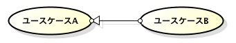*B=A+α*

<a id="usecaseDia/dependency"></a>
##### [包含(inclusion) / 包含関係(include relationship)](#usecaseDia/element)

`<<include>>`キーワードをつける(UML 1では`<<includes>>`だった)。柄のユースケースが、鏃のユースケースに含まれる。
複数のユースケースに(**共通で利用**している)**必須ユースケース**があるとき、その共通部分のユースケースを切り出し、包含の関係で接続する。ベースとなるユースケースからサブルーチンコールのような感じで呼び出されるようなケース。include先は複数のユースケースで共有できる。共通部分が多い場合に包含を使い、共通部分が少しの場合汎化を使う。一方が**他方の系列の中で実行される**関係。

 *A[B] includes common usecase.*

##### [拡張(extension) / 拡張関係(extend relationship)](#usecaseDia/element)

`<<extend>>`キーワードをつける。柄が**オプショナルのユースケース**で、鏃がベースのユースケース。
あるユースケースの一部分が利用されたり、利用されなかったり、**オプショナルな**部分をオプショナルユースケースとして切り出し、オプショナルユースケースでベースのユースケースを拡張する。オプショナルユースケースを行うのに**ベースのユースケースが必須**となる。複数のユースケースで共有でき無い。一方の系列の**一部を他方の系列が置き換える**関係。

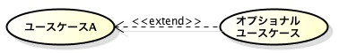 *Optional usecase extends A.*

<a id="usecaseDia/border"></a>
## [システム境界](#usecaseDia/element)

対象とする(サブ)システムの内部と外部の境界。**主題(subject)**とも言う省略可。サブシステムの場合`<<subsystem>>`キーワードをつけておくと良い。


## ユースケース図の注意点


**機能の階層構造(WBS:Work Breakdown Structure)**を作りすぎないようにする。
WBSができてしまわないように、`<<include>>`の階層を1,2層ぐらいにとどめておく。

- *「DVDを宅配で借りる」は、「DVDを借りる」の特殊なユースケースとなっているが、中身は異なる。*

- *「会員かどうかを確認する」は、`<<include>>`で接続されているので「DVDを借りる」のに必須。*
- *「カードで支払う」は、`<<extend>>`で接続されているので「DVDを借りる」のに必須ではない。*

## ロバストネス図(Robustness Diagram)/分析クラス(Analysis Class)/BCE図(Boundary Control Entity Diagram)


ユースケースを分析して、バウンダリ、コントロール、エンティティに分解した図。
ユースケースと静的モデルとの対応関係を検討するためのもの。UML１では拡張プロファイルとして規定されていたが、UML2ではなくなった。
 

拡張要素 | 表示形式 | 意味
:--- |:---: |:---
バウンダリ(boundary) |  | ユーザとシステムの境界。UIを提供するクラス。
コントロール(control) |  | ユースケースの機能ロジックを提供するクラス。
エンティティ(entity) |  | ドメイン層の型であるクラス。

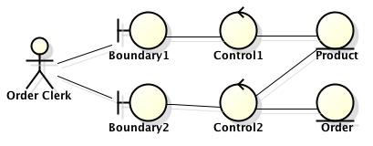

--
[ユースケース図](#usecaseDiaSec)　[目次へ戻る](#agenda)

--
<a id="classDiaSec"></a>
# [クラス図(Class Diagram)](#agenda)

クラス間の**静的**な関係、**論理的な集まり**を表現する。DBの設計ではER図の代替としても利用できる。クラス間の関係では、依頼・参照・使用・集約・**状態**などを表現する。

## クラス図の要素
<a id="classDia/element"></a>

要素 | 表示形式 | 意味
:--- |:---: |:---
[クラス(class)](#classDia/class) | 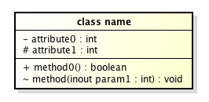 | オブジェクトを属性(構造)と操作(振る舞い)の共通性に着目し、**抽象化**しもの。「もの」「ひと」「こと」を**抽象的**に表現する。
[関連(association)](#classDia/association) |  | クラス間に**構造的(静的)**な関係を示す。鏃をつけて方向性の指定も可能。
[集約(aggregation)](#classDia/aggregation) |  | 関連の一種。**Part-Of**の関係。全体側の端にひし形を付ける。
[合成集約,コンポジション(composition)](#classDia/composition) |  | 集約の一種。全体側と部分側の**ライフサイクルがほぼ同一の場合**利用する。
[依存(dependency)](#classDia/dependency) |  | あるクラスが別のクラスを利用する関係。利用されるクラス側に鏃を付ける。
[実現化(realization)/実装(implementation)](#classDia/realization) | 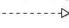 | 依存関係の一種。**インターフェース**や**テンプレートクラス**とその実装を持つクラスやコンポーネント,サブシステム etc.とそのインターフェースとの関係。
[汎化(generalization)](#classDia/generalization) |  | スーパークラス側に鏃をつけてサブクラスを汎化する。**Is-a**の関係。
[N項関連(N-ary association)](#classDia/N-aryAssociation) |  | ３つ以上のクラス間に関連がある場合に、N項関連を作ることができる。
[限定子(qualifier)](#classDia/qualifier) |  | 多重度を限定するために、関連の端に付ける。**相手側**のクラスの属性を限定子属性に指定し、**相手側**の多重度を限定する。
[インターフェース(interface)](#classDia/interface) |  | 外部に公開する操作を明確にし、実装側の変更を呼び出し側が受け無いようにする。

<a id="classDia/class"></a>
## [クラス(class)](#classDia/element)

オブジェクトを属性(構造)と操作(振る舞い)の共通性に着目し、**抽象化**しもの。「もの」「ひと」「こと」を**抽象的**に表現する。
雛形としてオブジェクトを生成することを**インスタンス化([名]instantiation, [動]instantiate)**という。クラス間の関係では、依頼・参照・作成・使用・集約・状態などを表現する。

- **カプセル化(Encapsulation):　**公開部分と非公開部分に分解し、決まったインターフェースのみで内部にアクセスを可能にすること(**情報隠蔽**)
- **ポリモルフィズム(Polymorphism:多態性、多相性、多様性):　**１つのインターフェースの元に様々な実装を隠すこと。保守性を向上させる。
- **継承(Inheritance):　**クラスの性質を受け継いで再利用性を上げる(sub class **Is-A** super class).

--

- **動的分類(Dynamic Classification)：　**あるクラスのインスタンスがライフサイクルの途中で別のクラスに分類(鞍替え)されるという概念 *例：　学生クラスのインスタンスが社会人クラスのインスタンスに変わる*
- **多重分類(Multiple Classification[Specification])：　**インスタンスが複数のクラスに帰属できるという概念。`{overlapping}`制約で表現する。*例：人クラスのインスタンスは国クラスのインスタンスでもあり、性別クラスのインスタンスでもある*
- **多重継承(Multiple Inheritance)：　**２つ以上のスーパークラスと継承関係
- **[パワータイプ（べき型）(Powertype)：　](#classDia/powertype)**そのインスタンスが別のクラスのサブクラスでもあるもの。*例：　「乗り物の種類」は「乗り物」のパワータイプ*

### クラス名の表記

クラス名には、パッケージ名を修飾できる。

```
パッケージ名::クラス名
```

### 属性の表記

属性は隠すことができる。可視性、属性の型、初期値は省略できる。属性リストの区画は省略できる(クラス名の下の区画が操作リストの区画になる)。

```
可視性等 属性名:属性の型=初期値
```

### 操作の表記

可視性、引数名、引数の型、戻り値の型は省略できる。

```
可視性 操作名(引数名:引数の型):戻り値の型
```

### 可視性(visibility) / 派生(導出)属性(derived attribute)

属性名や操作名の前に記述する。

記号 | 意味 | 説明
:---: |:--- |:---
`+` | public | 全てのクラスから参照可能
`-` | private | 自分自身のクラスからのみ参照可能
`#` | protected | 自分自身およびサブクラスから参照可能
`~` | package | 自分自信および同一パッケージ内のクラスから参照可能
`/` | derived | 他の属性から計算できる**属性(操作には付与できない)**。計算に時間がかかる場合など、主にパフォーマンスのために持たせる。

### スコープ

属性(フィールド)や操作(メソッド)に**クラススコープ**と**インスタンススコープ**を設定できる。クラススコープの場合には、属性名、操作名にアンダーバーを引く。

## UMLの拡張

#### ステレオタイプ

UML要素(クラスやオブジェクト)につけて意味を拡張する。クラスに付ける場合は、クラス名の前か上につける。
属性や操作の並び(**上側に**)ステレオタイプを付けると**別のステレオタイプが指定されるまで**同じステレオタイプが適用されるが、属性/操作の**前に**付けると**その属性/操作のみ**に適用される。

```
<<stereotype>>
```

*クラス分類のステレオタイプの例:　*3層アーキテクチャ(3-layer architecture)だと原則的には、`<<boundary>>`同士の関連、`<<boundary>>`と`<<entity>>`の関連は無い

ステレオタイプ | 意味
:----------: | :---
`<<boundary>>` | システムとその外側とをつなぐUI, IO, デバイス制御などのクラス。プレゼンテーション層相当。 
`<<control>>` | 複数のオブジェクトが関係するような、まとまった処理手順を司るデータフローや画面遷移、○○処理などのクラス。 アプリケーション層相当。
`<<entity>>` | データに関する基本的な処理や保持を行うクラス。データ層相当。

<https://en.wikipedia.org/wiki/Multitier_architecture>

#### メタ属性

UMLの要素(クラスやオブジェクト)につけて、情報を付加する。

```
{属性1=値1, 
  ...
属性n=値n}
```

`{ordered}`, `{abstract}`

#### 制約(constraint)

UML要素に条件や制限を付ける。

```
attribute{constraints}
```

`{XOR}`

## クラス間の関係

クラス間の関係では、**依頼、参照、作成、使用、集約、状態**などを表現する。クラス同士を関係づけることで**構造化された情報を表現**でき、より複雑な情報を表現できる。

- [関連(association)](#classDia/association)
	- [集約(aggregation)](#classDia/aggregation)
	- [コンポジション(composition)](#classDia/composition)
- [依存関係(dependency)](#classDia/dependency)
	- [実現(realization)/実装(implementation)](#classDia/realization)
- [汎化(generalization)](#classDia/generalization)

<a id="classDia/association"></a>
## [関連(association)](#classDia/element)

クラス間に構造的な関係があるときに実線で結ぶ。
線の上に**関連名**を付けることができ、任意で、関連名を**読む方向**を▶︎で表現できる(関連名は通常３単現の動詞)。
**関連端末名(ロール名)**をつけて関連のあるクラスからみた端末のクラスが何なのかを表現できる。


### 多重度(multiplicity)

**ターゲット**クラスの**あるオブジェクト**が関連しているソースクラスの**オブジェクト数**(総インスタンス数ではない)。オブジェクト図(に相当する集合図)とER図のcrow's footを見ればイメージしやすい。


| 多重度の表記 | 意味    |
| ---------- | ------ |
| x..y       | xからy  |
| 0..* or *  | 0以上   |
| x..*       | x以上   |
| x, y, z    | x, y, z|

*例:　* ロールをつけて関連ごとに分けてみないと、多対多の関連(リンク)があるように見える場合があるので注意。

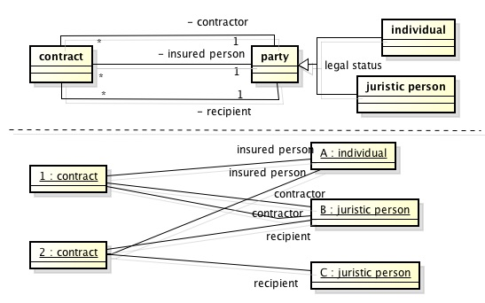

*例:　*下限が1の場合、Aのインスタンスが存在するときBのインスタンスが必ず存在する(インスタンスの生成順序や生存期間を気にしなければなら無い)。下限が0ならBのインスタンスが存在しなくても良い。

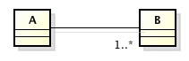

*例:　*１対多

*AからBへの多重度が1なのでBのオブジェクト(b3)が単独で存在できない。BからAへの多重度が0以上なのでAのオブジェクト(a2)が単独で存在できる。AからBへの多重度が1なのでb2から複数のリンク(a2からb2へのリンク)を貼れない*

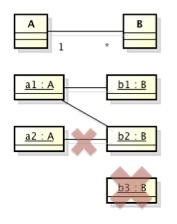

### 誘導可能性(navigability)

関連の端に矢印か罰印つけて**方向性(誘導可能性)**をつけることができる。
``[A]×->[B]``ならAからBが参照可能で、BからAは参照不可能。罰印も矢印も無い場合は、UML2.0では**不定**を示す。
双方向の関連をつけることもできる(片方向の関連よりメンテコストは高くなりやすい)。

### 再帰的関連(recursive association)

同一クラスの複数のオブジェクト間の関連(**同一クラスの同一のオブジェクト間に関係がある場合に引くわけではない**)。

再帰的関連になっている場合は、**ループを許すかどうか**(任意のインスタンスから再帰的にナビゲートして出来上がるインスタンスのツリー構造の中にそのインスタンス自身が存在するかどうか)に注意する。制約`{階層}`をつけてノートで定義しておくと良い。


*例: ディレクトリー構造。entryからdirectoryへの多重度が0 or 1なのでトップレベルに複数のentryがある。ループするような関連を許さない場合は制約をつける*

*例: 上司と部下の関係。AがBの上司かつBがAの上司、あるいは、AがAの上司という関係はおかしいので制約をつける必要がある*

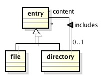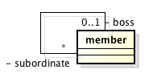

```
{階層}
制約：
　上司及び部下に向かって再帰的にナビゲートして出来上がるインスタンスの
　ツリー構造の中に再び自分が存在しないこと
```

<a id="classDia/qualifier"></a>
### [限定子(qualifier)](#classDia/element)

keyが指定されれば、valueが特定されるような関係を示すために、**限定子**を使う。限定子を使うことで多重度を限定できる。限定子(小さい長方形)に書き込む限定子属性は、限定子と**逆側のクラスの属性**(複数でも良い)を指定し、**逆側端の多重度**を限定する。

 *borrower側の多重度を1に限定している*


### 関連クラス(association class)

**多重度が多対多**で接続されたクラス間の情報を管理したいときに利用される、クラスと関連の性質を持ったクラス(関連の合間で仲介するクラス)。関連と関連クラスを点線で結んで表記する。
２つのクラスに**関連が引かれたときに発生するような(どちらの属性にするか迷うような)情報**に使われることが多い。両端のクラスが関連クラスのインスタンスを**別々に**持っている可能性がある。**関連クラスは１対多なら多側のクラスに紛れ込ますことが多い。** また、関連は集合であり重複せず、関連クラスもその性質を持っており、**特に宣言しない限り、同じインスタンス同士のリンクは重複しない(インスタンスの組み合わせがユニーク)。**

*(狭義の)関連クラスの例:　(同じ学生が同じ授業を何度も受講できない)* 


*例:　２社間契約* 

ある契約に対して両社それぞれに契約書を作るので、契約から見た契約書の多重度は2。一つの契約書に対して* **別々の** 会社甲乙が関連付けされる。ある会社が複数の契約を締結するので再起関連の多重度は多対多。

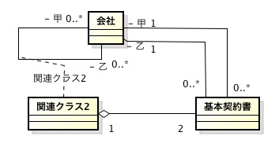

#### 広義の関連クラス

多対多の関連がある場合、広義の関連クラスに置き換えて実装すると良いことが多い。(狭義の)関連クラスとは異なり、**特に宣言しない限り、ユニーク制限はない。**

 
*広義の関連クラスの例:　特に制限がないため同じ学生が同じ授業を何度も受講できる。授業・学生でユニークという制約をつけると上の例と同じ*

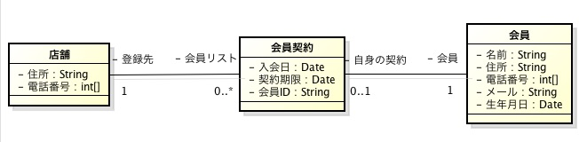

<a id="classDia/N-aryAssociation"></a>
### [N項関連(N-ary association)](#classDia/element)

3つ以上の関連には**N項関連(N-ary association)**を利用する。ひし形を中継点として各関連クラスを実線(関連)で結ぶ。

N項関連にも関連クラスをつけることができる。２項関連と同様に広義の関連クラスにすることもできる。多項関連になっている場合は、インスタンスの生成単位が曖昧になっているので、**どの単位でユニーク制約を課すかを検討してノートをつけておく。**

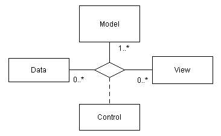

<a id="classDia/aggregation"></a>

### [集約(aggregation)](#classDia/element)

**Part-Of**の関係(*例：　注文明細は注文に集約されている*)。全体側の端にひし形を付ける。
集約にも方向性を指定できる。
**集約では、主に全体側から部分側への方向性が指定されることが多い。**
**一時的に**所有するような場合には集約ではなく、**依存関係**になることが多い。


<a id="classDia/composition"></a>
### [コンポジション(composition)](#classDia/element)

集約の一種。全体側と部分側の**ライフサイクルがほぼ同一の場合**利用する。ひし形を黒塗りにする。全体側のクラスを**コンポジットクラス(composite class)**と言い、表記方法が３種類ある。

コンポジションによる表記 | 部分側クラスの入れ子表記 | 部分側クラスの属性表記
:---: | :---: | :---: 
 |  | 

<a id="classDia/dependency"></a>
## [依存(dependency)](#classDia/element)

利用される側に鏃を付ける。**属性値として持っている場合は集約やコンポジション。**

- 引数や戻り値で受け取る
- ローカル変数として使用する（一時的にインスタンスを生成する・メッセージを送信する）
- モデルやパッケージ内からグローバルに見える他のクラスのオブジェクトを参照する

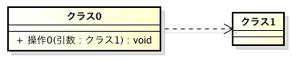

<a id="classDia/realization"></a>
### [実現化(realization)/実装(implementation)](#classDia/element)

**インターフェース**や**テンプレートクラス**とその実装を持つクラスやコンポーネント,サブシステム etc.とそのインターフェースとの関係。
インターフェース、テンプレートクラス側に鏃を付ける。

<a id="classDia/interface"></a>
#### [インターフェース(interface)](#classDia/element)

外部に公開する操作を明確にし、実装側の変更を呼び出し側が受け無いようにする。インターフェースは**属性を持たず、インスタンス化できない**。interfaceは必ずしも**javaなどのinterfaceで実装されるとは限らない**。
ステレオタイプ`<<interface>>`をつけた実現関係を引く。

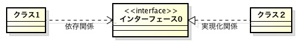

- ロリポップで提供インターフェースと実現化関係を略記できる


- ロリポップと組み合わせて必要なインターフェース(要求)の表記ができる


#### テンプレートクラス(template class)

クラスを生成するクラス。仮パラメタに具体的な値をバインドすることで実際に使用可能なクラスを生成する。

- 明示的束縛(explicit binding)

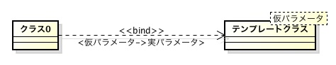

- 暗黙的束縛(implicit binding)


<a id="classDia/generalization"></a>
## [汎化(generalization)/継承(inheritance)](#classDia/element)

**Is-A**の関係。スーパークラス側に▷をつける。線に**区別子**(テキストラベル)をつけて汎化関係のグループ化ができる。

#### 汎化関係の制約

制約 | 意味
:---: | :---
`{overlapping}` | 一つの方に対して**汎化セット(generalization set)**が複数定義されている**多重分類(multiple classification)**を表現する。あるスーパークラスのインスタンスは、２つ以上のサブクラスのインスタンスを持つ可能性がある。
`{disjoint}` | あるスーパークラスのインスタンスは、１つのサブクラスのインスタンスしか持てない。
`{complete}` | 汎化階層に、新たなサブクラスを追加することができない。補集合がない。
`{incomplete}` | 汎化階層に、サブクラスが追加される可能性がある。補集合がある。 **補集合(スーパークラスに属すが汎化階層のどのサブクラスにも属さないもの)が存在し得る。(デフォルト)**

*例: 汎化セットが複数あるので{overlapping}を付けて明示する*

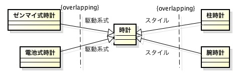

*例: 汎化して{xor}付きの関連をまとめる。補集合(B1でもB2でもないがBに属すもの)が無いので{complete}を付けている。片方の多重度の情報が失われているのでノートで制約を付ける。*

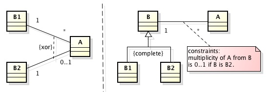

- *{ordered}*　インスタンスがあるルールで並んでいるという関連端(association end)のプロパティ。**制約ではない**

- **動的分類(dynamic classification)**

同じ分類軸にある部分集合の間を、インスタンスが行ったり来たりすることを許す分類。`<<dynamic>>`キーワードを定義して、汎化セット名の近くにつけておくと良い。
フラグやStateパターンなどで実装できる。

#### 抽象クラス(abstract class)

オブジェクトを生成することが無い。下位のクラスをまとめるクラス。クラス名を**斜体**にする、あるいは、メタ属性**{abstract}**をつけて表記する。
抽象クラスは、**インスタンスを作れず、属性と操作をもつが一部操作は具象クラスの再実装を要する**。

## その他のクラス

### ユーティリティクラス(utility class)

クラスにステレオタイプ`<<utility>>`を記述して、**他のクラスやプログラムから全て参照可能**なユーティリティクラスを定義できる。

### メタクラス(meta class)

クラスにステレオタイプ`<<metaclass>>`を記述して、**生成されるインスタンスがクラスである**メタクラスを定義できる。クラス自体の定義に利用される。

*参考*

- <http://www.umlcert.org/reading/ocup_blog/07.html>
- <https://en.wikipedia.org/wiki/Metaclass>


## 導出/派生(derivation)

既存の属性や関連から、論理的に導出すること。導出方法をノートしておくと良い。

### 導出属性(derived attribute)

他の属性から導出できる属性。`/`をつける。

### 導出関連(derived relationship)

ある既存の属性や関連から、論理的に導出できる導出できる関連。関連端には`/`をつける。想定上のリンクの存在制約なので`{derived}`をつけておく。

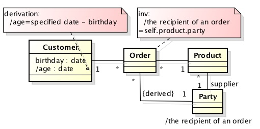

### 導出クラス(derived class)

導出属性を型として外出ししたもの。RDBMSのView(導出表)などが実装方法として考えられる。
導出クラス名には`/`をつける。

<a id="classDia/powertype"></a>
## べき型(powertype)

基本となる型をカテゴライズする型。ベースとなる型のインスタンス生成を制約するのが主な目的。べき型からなる構造を**知識レベル(knowledge level)**, ベースとなる型からなる構造を**操作レベル(operation level)**と呼ぶ。

*例:　*幾つかの個客種、商品種、注文種の組み合わせが決まっていて、それに反する注文は出来ない(インスタンスはない)。

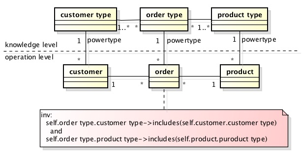


*注文と出荷の例:　*予定と実績の対応関係は知識レベルと実績の対応関係にある。


## クラス図の注意点

### 関連の誘導可能性

*例:　*unreachableが独立するスレッドで動いて動作の起点になっているようなことがなければunreachableクラスは必要ない

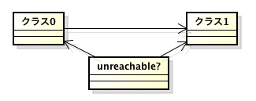

### 汎化と関連

*例:　*OKとキャンセルのボタンを一つずつ持つdialog

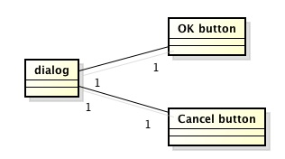

*例:　*ボタンを汎化(抽象化)したが、謝った関連になっている(OK buttonが2つまたは、Cancel buttonが２つになる可能性がある)


*例:　*汎化したボタンとの正しい関連

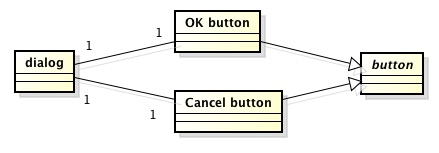

### 汎化と実現化の使い分け

クラス　　　　　　　　　　 | 関係
--------------------- | ----
スーパークラスとサブクラス | 汎化
interfaceと実体        | 実現化
テンプレートクラスと実体  | 実現化(依存)
抽象クラスと具象クラス    | 汎化　

### 集約とコンポジション

集約は、全体側オブジェクトと部分側オブジェクトのライフサイクルは必ずしも一致せず、部分側オブジェクトは**複数の全体側オブジェクトから共有されることがある**。

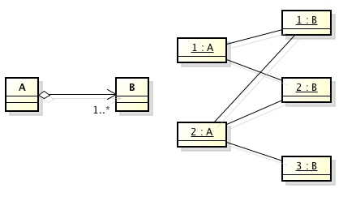

コンポジションは、**全体側オブジェクトと部分側オブジェクトのライフサイクルがほぼ一致し、部分側オブジェクトから見て全体側オブジェクトは常に一つ(全体と部分は不可分)**。**全体側の多重度は常に１か0になる**。(*UML 2.xで制約が緩められている*)

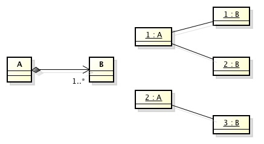

--
[クラス図](#classDiaSec)　[目次へ戻る](#agenda)

--
<a id="objDiaSec"></a>
# [オブジェクト図(Object Diagram)](#agenda)

システムのある瞬間の状態など、**静的な側面**を表現する。**ある瞬間のオブジェクトの状態**や、クラス図の**多重度**を考えるときに使用する。オブジェクトは「もの」「ひと」「こと」を**具体的**に表したもの。

## オブジェクト図の要素
<a id="objDia/element"></a>

要素 | 表示形式 | 意味
:--- |:---: |:---
[オブジェクト(object)](#objDia/object) |  | クラスのインスタンス。オブジェクトの**属性値**を記述できる。**操作は記述しない。**
リンク(link) |  | 関係のインスタンス。**オブジェクト間の関係**を示し、なんらかの**情報のやり取り**があることを表す。

<a id="objDia/object"></a>
## [オブジェクト(Object)](#objDia/element)

**属性**(静的かつ単純な情報)、**振る舞い**(動的な手続き)と**状態**を持つ。**メッセージ送信**でオブジェクト間の情報のやり取りを行う。分析段階では現実に存在するもの(物理的あるいは概念的に存在するもの)で、設計段階では、必ずしも実在するものとは限らない(list, stack, utility etc.)。

*クラスのインスタンスはオブジェクト、関係のインスタンスはリンク、ユースケースのインスタンスはシナリオ*

- オブジェクト名のフォーマット

ブジェクト名にアンダーバーを引く。

```
オブジェクト名           
オブジェクト名:クラス名　　                //クラス名修飾
オブジェクト名:クラス名,スーパークラス名,..  //スーパークラス修飾, 複数指定できる
:クラス名                               //オブジェクト名省略
オブジェクト名:パッケージ名::クラス名       //クラス名のパッケージ修飾
```

*クラス名(パッケージ含む)とオブジェク名のどちか一方を省略可能*

### コンポジットオブジェクト(composite object)

コンポジットクラスのオブジェクト。


--
[オブジェクト図](#objDiaSec)　[目次へ戻る](#agenda)

--
<a id="seqDiaSec"></a>
# [シーケンス図(Sequence Diagram)](#agenda)

*参考：*[Demeterの法則(Law of Demeter (LoD)), 最小知識の原則(principle of least knowledge)](https://en.wikipedia.org/wiki/Law_of_Demeter)

相互作用図(interaction diagram)の一つ。
**ライフライン**(人や物、オブジェクト)同士のメッセージのやり取りを**時系列に沿って１つのシナリオ(ユースケース)の具体的な流れ**整理する。*1つのシナリオ(ユースケース)*に沿って作成する。

## シーケンス図の要素

要素 | 表示形式 | 意味
:--- |:---: |:---
生存線、ライフライン(lifeline) | 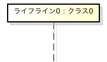 | `役割名:分類子名`　役割名、分類子(クラス、データタイプ、インターフェース、コンポーネントなど)名のどちらかは省略可能
アクター(actor) |  | モデリング対象のシステムから見たアクター。他のシステムもアクターになりうる。
実行指定,活性区間,実行仕様(execution spec) | 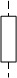 | メッセージの制御関係、実行期間
同期メッセージ(synchronous message) | 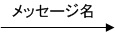 | メッセージの呼び出し終了を待つ
非同期メッセージ(asyncronous message) | 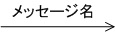 | メッセージの呼び出し終了を待たない
応答,戻り(reply) |  | 送信先から送信元への応答
生成メッセージ(create message) |  | ライフラインを生成するメッセージ。リプライと同じ記号をライフラインにつなげる。
拾得メッセージ(found message) | 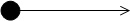 | 送信元が明確でない場合のメッセージ受信
消失メッセージ(lost message) | 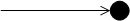 | 送信先が明確でない場合のメッセージ送信 
生成メッセージ(create message) |  | ライフライン生成。`<<create>>`を付ける場合もある。**リプライと同じ矢印**
消滅メッセージ(destroy message),停止 |  | ライフライン消滅。`<<destroy>>`を付ける場合もある。


## メッセージのフォーマット

```
シーケンス番号[ガード条件]*[繰り返しの条件]:戻り値リスト:=メッセージ名(引数リスト)
```

*メッセージ名のみ必須*

`*`は繰り返しを示す。

*例: a=bのとき-1と123を引数にしてmethodを呼ぶ(シーケンス番号2)*

```
2 [a==b] method(-1, 123) 
```

*例: i=0,1,..,5で反復してmethodを呼び出し、戻り値resultに格納(シーケンス番号2.1)*

```
2.1*[i=0..5]:result:=method()
```


受信側の視点で命名すると良い。シーケンス図の例とその疑似コード(swift)。**ライフラインの生成と消滅に注目しなくても良い場合は、生成、消滅の記述は省略する。関数の呼び出し関係を表現するために、シーケンス番号にサブ番号をつける。**

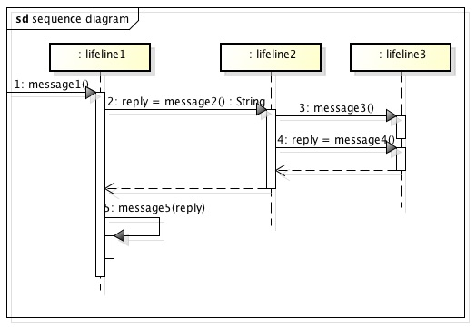

```swift
class lifeline1 {
    func message1() {
        let reply = lifeline2().message2()
        self.message5(reply)
    }
    func message5(reply: String) { print(reply) }
}
class lifeline2 {
    func message2() -> String {
        let l3 = lifeline3()
        l3.message3()
        return l3.message4()
    }
}
```

## 結合(複合)フラグメント(combined fragment)
<a id="seqDia/fragment"></a>

結合フラグメントを使って、フレーム単位に分割記述できる。

相互作用操作子(interaction operator) | 読み | 意味
:--- | :--- | :---
[`ref`](#seqDia/fragment-ref) | 参照(reference)/相互作用使用(interaction use) | 別のシーケンス図を参照する
[`alt`](#seqDia/fragment-alt) | alternative | 条件分岐する
[`opt`](#seqDia/fragment-opt) | option | 条件を満たした場合のみ処理する
[`par`](#seqDia/fragment-par) | parallel | 並列処理する
`seq` | weak sequencing | 実行順序が緩い処理
`strict` | strict sequencing | 厳密に実行順序が決まっている処理
[`loop`](#seqDia/fragment-loop) | loop | 繰り返し処理をする
[`break`](#seqDia/fragment-break) | break | 処理の中断をする
[`critical`](#seqDia/fragment-critical) | critical section(region) | 同期処理などの排他制御
[`assert`](#seqDia/fragment-assert) | assert | 処理が妥当であるための定義
[`neq`](#seqDia/fragment-neg) | negation | 本来実行されるはずがない処理
[`ignore`](#seqDia/fragment-ignore) | ignore | 重要ではない処理
[`consider`](#seqDia/fragment-consider) | consider | 重要な処理 

<a id="seqDia/fragment-ref"></a>
### [参照(`ref`)](#seqDia/fragment)

別に定義されている要素を参照する。


*sequence diagram 2を参照する。*

<a id="seqDia/fragment-alt"></a>
### [条件分岐(`alt`)](#seqDia/fragment)

点線で区切られた区画のうち、ガード内の条件が成り立つものだけが実行される。**同時に実行されることはない**。

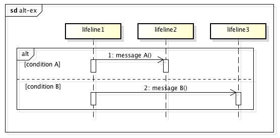

*condition Aならmessage A, condition Bならmessage Bが送信される。*

<a id="seqDia/fragment-opt"></a>
### [条件判断(`opt`)](#seqDia/fragment)

ガード内の条件を満たす時だけフラグメント内の処理が実行される。


*condition Aのときのみmessage  Aが送信される。*

<a id="seqDia/fragment-par"></a>
### [並列処理(`par`)](#seqDia/fragment)

点線で区切られた各区画を並列処理する。

<a id="seqDia/fragment-critical"></a>
### [クリティカルセクション(`critical`)](#seqDia/fragment)

そのフラグメントを実行するスレッドが常に一つでフラグメントが終了するまで別のスレッドを実行できない。割り込みや中断を許さない。


*message Aとmessage Bは同期処理だが並列に実行される。ただし、message Cが実行されれば、その応答が返ってくるまで、他のスレッドは止まる。*

<a id="seqDia/fragment-loop"></a>
### [反復処理(`loop`)](#seqDia/fragment)
 
フラグメント内を繰り返し処理する。反復条件は、ヘッダに`loop[開始, 終了]`, `loop[反復回数]`, `loop[開始,*]`という形式で書くか、フラグメント内にガード条件として定義できる。

<a id="seqDia/fragment-break"></a>
### [中断処理(`break`)](#seqDia/fragment)

ガード条件が成り立つときに、フレーム内の処理を実行して外側のフレームを中断させる。

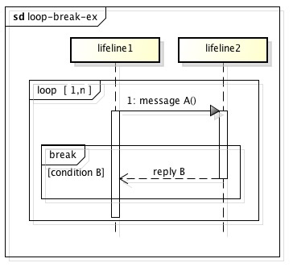

*n回message Aが送信されるが、condition Bが成立した場合はreply Bを返して中断する。*

<a id="seqDia/fragment-assert"></a>
### [アサート(`assert`)](#seqDia/fragment)

処理が妥当であるための定義(状態)を`{}`内を書く。

<a id="seqDia/fragment-neg"></a>
### [不正処理(`neg`)](#seqDia/fragment)

通常、起こり得ない処理。エラーハンドリングする。

<a id="seqDia/fragment-ignore"></a>
### [重要でない(`ignore`)](#seqDia/fragment)

フラグメント内の重要でない処理を`ignore{message_i, message_j,...}`の形式で示す。

<a id="seqDia/fragment-consider"></a>
### [重要(`consider`)](#seqDia/fragment)

フラグメント内の重要なメッセージを`consider{message_i, message_j, ...}`の形式で示す。

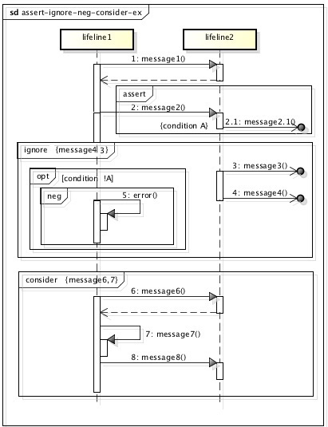

*message2, 2.1は妥当な状態condition Aになっているものとして処理する。message3,4は重要でないので無視しても構わない。condition Aになっていないならerror処理を行う。message6,7は重要な処理。*

## シーケンス図の注意点

ライフライン自身へのメッセージ(**再帰的メッセージ:recursive message**)があっても、クラス図で自分自身への**再帰的関連(recursive association)**があるとは限らない。別のライフライン(インスタンス)へメッセージがあり送信側と受信側両方のライフラインのクラスが同じ場合、再帰的関連となる。

--
[シーケンス図](#seqDiaSec)　[目次へ戻る](#agenda)

--
<a id="comDiaSec"></a>
# [コミュニケーション図(Communication Diagram)](#agenda)

旧コラボレーション図(collaboration diagram)。相互作用図の一つ。**ライフライン間のメッセージ**のやり取り、**システムの動的な側面**を表現する。**クラス図の操作**を検討することができる。

## コミュニケーション図の要素

要素 | 表示形式 | 意味
:--- |:---: |:---
ライフライン(lifeline) |  | `役割名:分類子名`　役割名、分類子(クラス、データタイプ、インターフェース、コンポーネントなど)名のどちらかは省略可能。**名前の書式はシーケンス図と同じだが、点線はない**。
同期メッセージ(synchronous message) |  | メッセージの呼び出し終了を待つ
非同期メッセージ(asyncronous message) |  | メッセージの呼び出し終了を待たない
応答,戻り(reply) |  | 送信先から送信元への応答
生成メッセージ(create message) |  | ライフライン生成。**リプライと同じ矢印**
リンク(link),関係 |  | データ.メッセージの送受信などやり取りが存在するライフライン間に引く。リンクに矢印(メッセージ)をつける。
データフロー | ♂ | データの流れ

- メッセージのフォーマット

```
先行子/シーケンス番号[ガード条件]*[繰り返しの条件]:戻り値リスト:=メッセージ名(引数リスト)
```

**シーケンス番号とメッセージ名のみ必須**

シーケンス番号のsuffixにアルファベットをつけると、**prefix(番号)が同じでsuffix(アルファベット)が異なるメッセージは並列処理**される。
**先行子**が指定されている場合は、指定したメッセージ送信が先に行われていることを表す。


*同期メッセージ1,2が送信され、続いて、非同期メッセージ3,4a,4b,5が送信されるが、4a, 4bが並列に送信される。5の送信には、先立って4bが送信されている必要がある。*

## コミュニケーション図の注意点

シーケンス図同様、ライフライン自身へのメッセージがあっても、クラス図で再帰的関連があるとは限らない。

--
[コミュニケーション図](#comDiaSec)　[目次へ戻る](#agenda)

--
<a id="stateMachineDiaSec"></a>
# [ステートマシン図(State Machine Diagram)](#agenda)

**１つ**の**オブジェクト(ライフライン)**の**生成から消滅まで**の時間経過に伴う**状態変化**を表現する。あるオブジェクトに注目し、そのオブジェクトに投げられるメッセージ(イベント)のみをフックして状態遷移させる。UML2から**(振る舞い)ステートマシン図**と**プロトコルステートマシン図(protocol state machine diagram)**を書き分けるようになった。

## ステートマシン図の要素
<a id="stateMachineDia/element"></a>

要素 | 表示形式 | 意味
:--- |:---: |:---
開始状態(begin, initial state) |  | オブジェクト生成時の状態、スコープ内([コンポジット状態](#stateMachineDia/compositeState))での開始状態。**コンポジット状態を除けば一つ**しか存在しない。
終了状態(sink state) |  | オブジェクト消滅の状態、スコープ内([コンポジット状態](#stateMachineDia/compositeState))での終了状態。必要なら複数存在する。
[状態(state)](#stateMachineDia/state) | 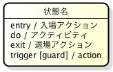 | オブジェクトの生成から消滅までの中で、ある一定の時間止まる状況
[状態遷移(state transition)](#stateMachineDia/transition) |  | 状態遷移を示す。トリガー、ガード、エフェクトは省略可能
[同期バー(分岐:fork, 合流:join)](#stateMachineDia/fork-join) |  | 分岐、合流の同期を明確に表現する。
[選択疑似状態(choice, conditional pseudo state)](#stateMachineDia/choice) |  | 前の状態を受けて、次の状態を選択するための仮状態。複数の条件に合致した場合は、遷移先は任意。合致するものがなければ記述の誤り。
[交差状態(junction)](#stateMachineDia/junction) |  | ２つ以上の遷移が集約される状態、または、２つ以上の遷移が離散する状態、あるいはその両方が起こる状態。**開始状態と同じアイコン。**
[領域(region)境界](#stateMachineDia/orthogonal) |  | サブ状態の区切り 
[履歴(history), 浅い履歴疑似状態(shallow pseudo state)](#stateMachineDia/history) |  | 包含する状態でアクティブだった最近の同レベルのサブ状態にもどる(**サブ状態のサブ状態の履歴は覚えない**。必要に応じてそのデフォルト状態にもどる)。１度もアクティブになっていなければ必要に応じてデフォルト状態に遷移する。
[深い履歴疑似状態(deep pseudo state)](#stateMachineDia/history) | 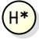 | 包含する状態でアクティブだった最近の**同レベルおよびその下のサブ状態**にもどる。１度もアクティブになっていなければ必要に応じてデフォルト状態に遷移する。
[入場点、エントリー状態(entry state)](#stateMachineDia/compositionIcon) | 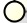 | [コンポジット状態](#stateMachineDia/compositeState)の入口。コンポジット状態のデフォルトでない開始状態としても使用可能。
[退場点、イグジット状態(exit state)](#stateMachineDia/compositionIcon) | 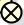 | [コンポジット状態](#stateMachineDia/compositeState)の出口。コンポジット状態のデフォルトでない終了状態としても使用可能。
[合成アイコン(composition icon)](#stateMachineDia/compositionIcon) | 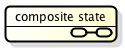 | サブ状態を省略したコンポジット状態

<a id="stateMachineDia/transition"></a>
## [状態遷移(state transition)](#stateMachineDia/element)

遷移の矢印に沿って状態間で**トークン(token)**を受け渡し、トークンを持っている状態がインスタンスの現在の状態となる。
ある状態から同じトリガーで別の状態に遷移する場合はガード条件を書いて分岐できる。


```
トリガ[ガード条件]/エフェクト
```

*ガード条件、エフェクトは必要なければ書かなくて良い。*

トリガがない場合は、**完了遷移(トリガレス遷移、λ遷移)**と言い、**アクション**や**アクティビティ**の終了をきっかけとして遷移する。

<a id="stateMachineDia/state"></a>
### 処理(評価)の順番


1. **入場アクション(entry action):　**状態に入るときに**瞬間的**に行われ、**中断しない**。
1. **アクティビティ(activity):　**状態に入るときに開始し、**一定時間継続する**。動作中にトリガーにより状態遷移で**中断される**。
1. **トリガー(trigger):　**なんらかの影響をもたらす事象。**外部からのメソッドコール**。
1. **ガード条件(gard):　**状態遷移可能かどうかの条件。**評価は全て同時で一瞬のうちに行われる**
1. **退場アクション(exit action):　**状態からでるときに**瞬間的に**行われ、**中断されない**。(アクティビティの後にトリガが発生しない or ガード条件を満たさないで遷移しない場合も実行される？ (L1 16章 2))
1. **エフェクト(effect):　**状態遷移と**同時に瞬間的**に行われ、**中断されない**。

### 据え置きイベント(deferred event)

アクションdeferがつけられたイベントは、**据え置きイベント(defferred event)**と呼ばれ、他の状態に遷移するまで捨てられずに処理が据え置かれる。

[参考](http://labo.mamezou.com/special/sp_002/sp_002_004.html)


*状態2でイベントが起こると据え置かれ、のちにトリガー2により状態1に遷移したとき、据え置かれたイベントが呼ばれて終了状態に遷移する。*

<a id="stateMachineDia/compositeState"></a>
## [コンポジット(合成)状態(composite state)](#stateMachineDia/element)

状態の内部にサブ状態をもつ状態。各スコープで開始状態は一つ。


*例１はサブ状態3でトリガー3がこないと終了しないが、例２はトリガ４で終了し、サブ状態がどれだったかは不明*

<a id="stateMachineDia/compositionIcon"></a>
合成アイコンを使ってサブ状態を省略できる。合成アイコン中のサブ状態と直結ばれた遷移には、入場点、退場点を使う(合成アイコンを使わない表記でもデフォルトでない入場点、退場点を作ることができる)。


<a id="stateMachineDia/orthogonal"></a>
### [直交状態(orthogonal state)](#stateMachineDia/element)

1つのコンポジット状態のなかで、**同時に**複数のサブ状態が存在する状態。点線で領域(UML1.xでは平行サブ状態)を作って表現する。それぞれの領域は**独立した状態**を持っている。


**各領域は独立しており、取りうる状態の数は2×2×2=8状態**

<a id="stateMachineDia/fork-join"></a>
### [平行遷移(concurrent transition)](#stateMachineDia/element)

**同期バー**を使って、**分岐(fork)**と**合流(join)**の同期を記述できる。forkした各サブ状態が終了するまでjoin地点で待つ。


<a id="stateMachineDia/history"></a>
### [履歴(history)](#stateMachineDia/element)

履歴を使って、コンポジット状態(の最後にアクティブであったサブ状態)を保存できる。
コンポジット状態に入るときは直接履歴に遷移を貼る。初めてアクティブになったときの開始状態を忘れないようにしておく。**浅い履歴はサブ状態のサブ状態までは覚えておけない。**コンポジット状態の開始状態の代わりに、履歴を使用しても良い。


*上の図の場合、コンポジット状態の開始状態および、sub1への遷移を取り除き、履歴からsub1の遷移を加えても良い。*

<a id="stateMachineDia/choice"></a>
## [選択疑似状態(choice, conditional pseudo state)](#stateMachineDia/element)

**動的条件分岐(dynamic conditional branch)**。選択疑似状態から出て行く遷移のうち、ガード条件に合致するものが１つもなければ、記述の誤り。[else]のガード条件を使うと良い。属性値をアイコンの中に書いて、ガード条件の左辺を省略しても良い。

<a id="stateMachineDia/junction"></a>
## [交差状態(junction)](#stateMachineDia/element)

**静的条件分岐 (static conditional branch)**。交差状態から出て行く遷移のうち、ガード条件に合致するものが１つもなくても良い。その場合は直ちに遷移しない(交差状態の前の状態のまま)。

## ステートマシン図の注意点

### ガード条件の評価

[参考](http://labo.mamezou.com/special/sp_002/sp_002_003.html)

遷移が起ころうとするのをガードするために付加する条件。**ガード条件がかけられている遷移が起ころうとする時にだけ評価される。**タイムイベント**after**を使ってポーリングしていれば、自己遷移によってガード条件の再評価が行われる。


*もしポーリング(after(1 sec))がなければ、開始状態から状態１になるときにトリガレス遷移のガード条件[B]が評価されて、Bを満たしていなければ状態2になることはない。*

ポーリングの代わりに、チェンジイベント**when**を使うことができる。whenイベントは、条件を常に監視していて、falseからtrueに変わった時に発火する。


*whenイベントは、チェンジイベントなので、開始状態で既に条件を満たしている場合は、発火しない。そのため、選択疑似状態を挟んでいる。*

### 選択疑似状態と交差状態

[参考](http://labo.mamezou.com/special/sp_002/sp_002_004.html)


*上の例だと最大で、actionが4回(retryは3回)行われる。選択疑似状態を交差状態に変えると、[failure]の評価と同時に[retry <= 3], [retry >3]が評価されて、retryのインクリメントが行われるので、最大でactionが5回(retryは4回)行われる。*

## プロトコルステートマシン図(Protocol State Machine Diagram)

インスタンスのとりうる状態ではなく、**状態ごとに許される操作**を記述する。
使う記号は(振る舞い)ステートマシン図と同じで遷移情報の記述の仕方だけ異なる。
図名の後ろに`{protocol}`をつけて明示する。

```
トリガ[ガード条件]/エフェクト //振る舞いステートマシン図
[事前条件]操作/[事後条件]    //プロトコルステートマシン図
```

振る舞いステートマシン図 | プロトコルステートマシン図
:---: |:---: 
 | 

--
[ステートマシン図](#stateMachineDiaSec)　[目次へ戻る](#agenda)

--
<a id="activityDiaSec"></a>
# [アクティビティ図(Activity Diagram)](#agenda)

システムや業務の流れを表現する。フローチャート的なもの。
ステートマシン図の全ての状態にアクティビティがついて、完了遷移を行うと、アクティビティ図になる。

## アクティビティ図の要素

要素 | 表示形式 | 意味
:--- |:---: |:---
アクティビティエッジ |  | **制御フロー**と**オブジェクトフロー**がある。オブジェクトに流入するフローをオブジェクトフローと言い、トークンは素通りして次のアクションを発火する。
開始状態(begin, initial state) |  | アクティビティ図の開始状態
終了状態(sink state) |  | アクティビティ図の終了状態。必要なら複数存在する。
フロー終了ノード(flow final node) |  | 流入するフローを止める(分岐している場合、流入していないフローはそのまま)。
コネクタ(connector) |  | ある端から他の端へ線を引かずにすませるためのもの。同じ文字が書かれているコネクタどうしが繋がっている。
同期バー(分岐:fork, 合流:join) |  | 分岐、合流の同期を表現する。UML2.0からオブジェクトフローをforkノードから出したり、joinノードに合流させたりしても良いことになった。
デシジョン/マージノード(decision/merge node) |  | 前のアクションを受けて、次の状態を選択するためのノード(**ノードの中には何も書かない**)。合致するものがなければ記述の誤り。`<<decisionInput>>`をつけたノートに判断基準を書いて付加して良い(ガードをつけて[true], [false] etc. で分岐する)。
アクションノード(action node) |  | その状態の中でアクティビティが終了すると、他の状態に遷移する状態。制御を表す。`<<localPrecondition>>`, `<<localPostcondition>>`と制約をつけたノートを付与することで、アクションの事前条件, 事後条件をつけることができる。
シグナル送信アクション(signal sending action) |  | オブジェクトへのシグナル送信の強調表記。
シグナル受信アクション(signal receipt action) |  | シグナル、イベントの発生待機、受信の強調表現。
タイムイベント(time evnet) |  | 時間に依存したイベント。出力だけ持ち、入力フローは持たない。
オブジェクトノード(object node) |  | 制御対象のオブジェクト。**パーティションをまたがってアクションを発火するためにオブジェクトを渡すことが多い。**同じ型の複数のインスタンスをまとめて処理したりする場合があるので、**オブジェクト名のアンダーラインは引かず**、インスタンスの重なりであることを示す。
例外(exception) |  | 例外発生
割り込み可能アクティビティ領域(interruptible activity region) |  |領域内の制御の流れが、割り込み可能。
拡張領域(expansion region) |  | オブジェクトフローで流れてきたオブジェクトの集合の各要素についての処理。`<<parallel>>`(並列処理), `<<iterative>>`(反復処理), `<<stream>>`(１回の実行で全ての要素を扱う)が設定できる。中のアクションが一つならアクションに直接拡張ノードを付与できる。
アクティビティパーティション(activity partition) |  | アクションをまとめることができる。入れ子、縦横の組み合わせが可能。

アクションノードから複数のオブジェクトにトークンを投げる場合`<<multicast>>`を、逆に複数のオブジェクトからアクションノードにトークンが投げられる場合`<<multi-receive>>`のキーワードをオブジェクトノードにつけておくと良い。

また、ユースケースに相当するアクションノードにユースケースのノートを`<<usecase>>`キーワード付きで載せると良い。

## プロセス図(Process Diagram)

**UML1.0**のアクティビティ図を拡張したもの。内容がはっきりしない段階の活動や行為の集合「プロセス」の大まかな流れを表す。*UMLに含まれるものでは無い。*


[図, 参考](http://www.bcm.co.jp/site/2002/uml/uml14.htm)

--
[アクティビティ図](#activityDiaSec)　[目次へ戻る](#agenda)

--
<a id="componentDiaSec"></a>
# [コンポーネント図(Component Diagram)](#agenda)

**物理的なシステム構成**、**実装**を表現する図の１つ。システムの**モジュール**構成、**ソフトウェアコンポーネント**の構成を表現する。ハードウェア的なものは表記しない。

## コンポーネント図の要素

インターフェースには、クラス図のものと同じアイコンも使用可能。**依存、実装などはクラス図と同じ記号**を使う。

コンポーネント間は**依存関係**により、ソースファイルのコンパイルや、実行ファイルの呼び出し関係を表現する。

要素 | 表示形式 | 意味
:--- |:---: |:---
コンポーネント(component) |  | あらかじめ決められたインターフェースを持った再利用部品。`<<component>>`をつけておけば右上のアイコンは不要。`<<subsystem>>`をつけるとサブシステムとなり、複数のコンポーネントを含む。オブジェクトからWebサービスまで様々なものがコンポーネントになりうる。
コンポーネントインスタンス(component instance) |  | コンポーネントのインスタンス。
分類子(classifier) |  | クラス、インターフェース、コンポーネントなど
成果物(deliverables) |  | コンポーネントが実装されている成果物。**物理的なファイル**、**DBのテーブル**など。右上にファイルアイコンをつけるか、`<<artifact>>`をつける。アンダーバーを引いてインスタンス化できる。
アセンブリコネクタ(assembly connector),要求/提供インターフェース(required/provided interface) |  | 要求インターフェースと提供インターフェースを結んだコネクタをアセンブリコネクタと言う。オス？側が提供インターフェース。アセンブリコネクタを使わず、コンポーネントに`<<provided interfaces>>`, `<<required interfaces>>`をつけても良い。
委譲コネクター(delegation conector) |  | インターフェースの実装を別のコンポーネントなどへ委譲することを示す。
依存関係(dependency relathionship), [マニフェステーション関係(manifestation relationship)](#deploymentDia/manifestation) |  | 成果物間、コンポーネント間の依存関係や、マニフェステーション関係(`<<manifest>>`)、インターフェースの実装、成果物の配置などを表す。

### コンポーネント間の関係
`<<copy>>`, `<<become>>`, `<<import>>` などのステレオタイプが仕様される。

### 委譲コネクター

インターフェースの実装を別のコンポーネントなどへ委譲することを示す。


--
[コンポーネント図](#componentDiaSec)　[目次へ戻る](#agenda)

--
<a id="deploymentDiaSec"></a>
# [配置図(Deployment Diagram)](#agenda)

**物理的なシステム構成**、**実装**を表現する図の１つ。**物理的な**ファイルを配置する**ハードウェア**構成を表現する。

## 配置図の要素
<a id="deploymentDia/element"></a>

要素 | 表示形式 | 意味
:--- |:---: |:---
[ノード(型)(node)](#deploymentDia/node) |  | システムリソースの仕様を表現する。`<<device>>`, `<<executionEnvironment>>`などのステレオタイプをつけることができる。
[ノードインスタンス(node instance)](#deploymentDia/node) |  | システムリソースを実際に何台か配置する場合に仕様する。ノード型のインスタンス。
分類子(classifier) |  | クラス、インターフェース、コンポーネントなど
コンポーネント(component) |  | あらかじめ決められたインターフェースを持った再利用部品。成果物とマニフェステーション関係を結ぶ。
コンポーネントインスタンス(component instance) |  | コンポーネントのインスタンス。
成果物(deliverables) |  | **物理的なファイル**、**DBのテーブル**など。ブラウザなども成果物になりうる。右上にファイルアイコンをつけるか、`<<artifact>>`をつける。アンダーバーを引いてインスタンス化できる。
アセンブリコネクタ(assembly connector),要求/提供インターフェース(required/provided interface) |  | 要求インターフェースと提供インターフェース。
依存関係(dependency relathionship), [マニフェステーション関係(manifestation relationship)](#deploymentDia/manifestation), [配置(deployment)](#deploymentDia/deployment) |  | 成果物間の依存関係や、マニフェステーション関係、インターフェースの実装、成果物の配置などを表す。
[通信経路(channel)](#deploymentDia/channel) |  | ノード間の関連(association)、リンク(link)の記号。`<<LAN>>`, `<<internet>>`, `<<RS232C>>`, `<<TCP/IP>>`, `<<IIOP>>`など**ハードウェア**や**プロトコル**のステレオタイプを指定できる。

<a id="deploymentDia/node"></a>
## [ノード(node)](#deploymentDia/element)
**メモリや処理機能**を持ち、演算を実行するコンピュータ、プリンタ、ハードウェアなどの**システムリソース**。ノードは入れ子にすることができる。
ノード型とノードインスタンスがある。

## 配置図の関係
<a id="deploymentDia/manifestation"></a>

### [マニフェステーション関係](#deploymentDia/element)

成果物(を含むノード)とコンポーネントの関係。成果物(実行ファイル、スクリプト, ソースファイル etc.)でコンポーネントを実現する。依存関係に`<<manifest>>`をつける。


<a id="deploymentDia/deployment"></a>
### [配置](#deploymentDia/element)

ノードと成果物(ノード)の配置関係を視覚表記、代替配置表記(依存関係に`<<deploy>>`をつける)、リスト表記で記述できる。


<a id="deploymentDia/channel"></a>
###[通信路](#deploymentDia/element)

ノード型には多重度をつけることができる。


--
[配置図](#deploymentDiaSec)　[目次へ戻る](#agenda)

--
<a id="compositeStructureDiaSec"></a>
# [合成構造図(Composite Structure Diagram)](#agenda)

あるクラスとその**内部構造**との関係の詳細を表す。クラス図のコンポジションをパートを用いてよりわかりやすくしたもの。

## 合成構造図の要素

要素 | 表示形式 | 意味
:--- |:---: |:---
パート(part) |  | 構造分類子の内部構造。多重度は`[]`で囲まずに右上に配置することもできる。
コネクタ(connector) |  | パートとパートの関係。
構造化分類子(structured classifier) |  | 内部構造を持つ分類子

--
[合成構造図](#compositeStructureDiaSec)　[目次へ戻る](#agenda)

--
<a id="timingDiaSec"></a>
# [タイミング図(Timing Diagram)](#agenda)

相互作用図の一つ。
**時刻と状態の変化**の厳密な関係を表現する。ステートマシン図と同様に、ライフラインの状態を表現するが、シーケンス図のように**複数のライフライン間**のメッセージのやり取りを表現することもできる。

## タイミング図の要素

要素 | 意味
:--- |:---
ライフライン(lifeline) | 相互作用を行う要素とその役割。
状態(state) | ライフラインが取る状態を表現する。
状態タイムライン(state timeline) | ライフラインがイベントによりどのような状態からどのような状態になるかをトレースする
イベント(ivent) | ライフラインの状態の変化をもたらす事象の発生
タイミングルーラー(timing ruler) | 時間軸の目盛
ティックマーク値(tick mark value) | 実際の時間を表現する数値


[参考](http://www.itsenka.com/contents/development/uml/timing.html)

--
[タイミング図](#timingDiaSec)　[目次へ戻る](#agenda)

--
<a id="interactionOverviewDiaSec"></a>
# [相互作用概要図(Interaction Overview Diagram)](#agenda)

相互作用図の一つ。[アクティビティ図](#activityDiaSec)と[シーケンス図](#seqDiaSec)を組み合わせ、複数の相互作用の関係を鳥瞰する。


## 相互作用概要図の要素

要素 | 表示形式 | 意味
:--- |:---: |:---
相互作用使用(interaction use) |  | ある相互作用の参照。
相互作用(interaction) |  | ライフライン間のメッセージのやり取りを表現する。
開始状態(begin, initial state) |  | 開始状態。
終了状態(sink state) |  | 終了状態。
デシジョン(decision) |  | 処理の流れの分岐を表現する。
遷移(transition) |  | 状態遷移

--
[相互作用概要図](#interactionOverviewDiaSec)　[目次へ戻る](#agenda)

--

<a id="OCLSec"></a>
# [オブジェクト制約言語(OCL: Object Constraint Language)](#agenda)

制約を記述する述語論理に基づく論理言語。

--
[オブジェクト制約言語](#OCLSec)　[目次へ戻る](#agenda)

--


# Review Point
- [[改訂版] UMLモデリング技能認定試験<入門レベル(L1)>問題集 -UML2.0対応](http://www.amazon.co.jp/%E6%94%B9%E8%A8%82%E7%89%88-UML%E3%83%A2%E3%83%87%E3%83%AA%E3%83%B3%E3%82%B0%E6%8A%80%E8%83%BD%E8%AA%8D%E5%AE%9A%E8%A9%A6%E9%A8%93-%E5%85%A5%E9%96%80%E3%83%AC%E3%83%99%E3%83%AB-%E5%95%8F%E9%A1%8C%E9%9B%86--UML2-0%E5%AF%BE%E5%BF%9C/dp/4774132454/ref=sr_1_1?ie=UTF8&qid=1443222547&sr=8-1&keywords=uml%E3%83%A2%E3%83%87%E3%83%AA%E3%83%B3%E3%82%B0%E6%8A%80%E8%83%BD%E8%AA%8D%E5%AE%9A%E8%A9%A6%E9%A8%93)
- L1:[徹底攻略UMLモデリング技能認定試験問題集―L1(T1/T2)対応 (ITプロ/ITエンジニアのための徹底攻略)](http://www.amazon.co.jp/gp/product/4844324829?psc=1&redirect=true&ref_=oh_aui_detailpage_o02_s00)

## 開発プロセス/モデリング

- 1章　9
- 12章　5, 8, 9
- L1 22章　3, 4

## ユースケース図

- 2章  15
- 13章　1, 2, 3, 4, 6, 8
- L1 12章　2, 7, 9

## シーケンス図

- 4章　4, 9, 12, 17
- 15章　4, 7, 8
- L1 14章　8

## コミュニケーション図

- 5章　1, 6, 8
- 15章　11
- L1 15章　2, 5, 6
- L1 22章 20

### コミュニケーション図とシーケンス図

- 10章　11

## ステートマシン図

- 6章　1, 7, 12, 14, 16, 17, 18, 19
- L1 16章　2
- L1 22章 22

### ステートマシン図とコミュニケーション図

- 10章　12

### ステートマシン図とクラス図

- L1 20章　5

## アクティビティ図

- 7章　2

## コンポーネント図

- 8章　1, 4, 9, 10, 11
- L1 22章　25

## 配置図

- 9章　3, 7, 8, 10
- 16章　5, 6

## クラス図とオブジェクト図

- 1章  2
- 3章　3, 5, 21, 22, 25, 26, 30, 31, 33, 34, 38, 41, 42, 44, 46, 51
- 5章　10, 13
- 14章　1, 2, 4, 8, 9, 10, 11, 13, 15, 19, 20, 21
- 17章　3, 6
- L1 13章　1, 6, 11, 13, 15, 17, 20, 23, 24
- L1 22章 10, 11, 14, 30

### クラス図とシーケンス図

- 17章　4, 11
- L1 20章　4, 9, 11
- L1 22章　17

### クラス図とコミュニケーション図

- 17章　5
- 1L 20章　6
- 1L 22章　29

--
# 関連知識

## CASE(Computer Aided Software Engineering)

ソフトウェア開発やソフトウェアの保守にソフトウェアツールを利用すること。

## CATWOE

- Customer(受益者または被害者)
- Actor(次の変換をトリガーする行為者)
- Transformation(システム全体が行う変換過程)
- Weltanschauung(世界観、価値基準)
- Owner(施主)
- Environment(環境からの制約)

に相当するものを明らかにして、基本定義(root definition)の意味を確認して合意する手法。

## ConOps(Concept of Operation)

情報システムの開発において，ユーザ要求を記述するために，IEEE Std 1362で定められたドキュメントの標準仕様。

参考

- [ISディジタル辞典－重要用語の基礎知識－](http://ipsj-is.jp/isdic/1292/)
- [Wikipedia](https://en.wikipedia.org/wiki/Concept_of_operations)

# メモ

# References

- [[改訂版] UMLモデリング技能認定試験<入門レベル(L1)>問題集 -UML2.0対応](http://www.amazon.co.jp/%E6%94%B9%E8%A8%82%E7%89%88-UML%E3%83%A2%E3%83%87%E3%83%AA%E3%83%B3%E3%82%B0%E6%8A%80%E8%83%BD%E8%AA%8D%E5%AE%9A%E8%A9%A6%E9%A8%93-%E5%85%A5%E9%96%80%E3%83%AC%E3%83%99%E3%83%AB-%E5%95%8F%E9%A1%8C%E9%9B%86--UML2-0%E5%AF%BE%E5%BF%9C/dp/4774132454/ref=sr_1_1?ie=UTF8&qid=1443222547&sr=8-1&keywords=uml%E3%83%A2%E3%83%87%E3%83%AA%E3%83%B3%E3%82%B0%E6%8A%80%E8%83%BD%E8%AA%8D%E5%AE%9A%E8%A9%A6%E9%A8%93)
- [徹底攻略UMLモデリング技能認定試験問題集―L1(T1/T2)対応 (ITプロ/ITエンジニアのための徹底攻略)](http://www.amazon.co.jp/gp/product/4844324829?psc=1&redirect=true&ref_=oh_aui_detailpage_o02_s00)
- [ダイアグラム別 UML徹底活用](http://www.amazon.co.jp/%E3%83%80%E3%82%A4%E3%82%A2%E3%82%B0%E3%83%A9%E3%83%A0%E5%88%A5-UML%E5%BE%B9%E5%BA%95%E6%B4%BB%E7%94%A8-DB-Magazine-SELECTION/dp/4798109304?ie=UTF8&keywords=UML%E5%BE%B9%E5%BA%95%E6%B4%BB%E7%94%A8&qid=1462439840&ref_=sr_1_2&sr=8-2)
- [UMLモデリング入門](http://www.amazon.co.jp/dp/4822283585/ref=pd_lpo_sbs_dp_ss_1?pf_rd_p=187205609&pf_rd_s=lpo-top-stripe&pf_rd_t=201&pf_rd_i=4822284646&pf_rd_m=AN1VRQENFRJN5&pf_rd_r=1AAF3ZV4P8CGR6MXXK8G)
- [UMLモデリングレッスン](http://www.amazon.co.jp/dp/4822283496/ref=pd_lpo_sbs_dp_ss_3?pf_rd_p=187205609&pf_rd_s=lpo-top-stripe&pf_rd_t=201&pf_rd_i=4822284646&pf_rd_m=AN1VRQENFRJN5&pf_rd_r=1AAF3ZV4P8CGR6MXXK8G)
- [OCUPブログ　第7回](http://www.umlcert.org/reading/ocup_blog/07.html)
- [Multitier architecture](https://en.wikipedia.org/wiki/Multitier_architecture)
- [Metaclass](https://en.wikipedia.org/wiki/Metaclass)
- [誤解しがちなモデリングの技
第3回：ステートマシン図（Ｉ）](http://labo.mamezou.com/special/sp_002/sp_002_003.html)
- [誤解しがちなモデリングの技
第4回：ステートマシン図 (II)](http://labo.mamezou.com/special/sp_002/sp_002_004.html)
- [連載第14－１回 UMLの基礎と応用](http://www.bcm.co.jp/site/2002/uml/uml14.htm)
- [タイミング図（Timing Diagram）](http://www.itsenka.com/contents/development/uml/timing.html)
- [ISディジタル辞典－重要用語の基礎知識－](http://ipsj-is.jp/isdic/1292/)
- [Concept of Operations](https://en.wikipedia.org/wiki/Concept_of_operations)
